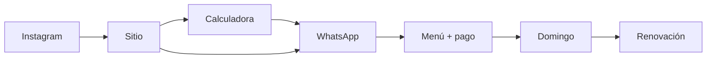

# Layout, UX y marketing funnel — sitio web

**Estado código:** `app/page.tsx` = MVP mise-only · **objetivo** = alinear con este plan (Fuego Lento hero).  
**Copy:** [`01_Copy_ES_Spanish.md`](01_Copy_ES_Spanish.md) · **Changelog:** [`05_Planning_Changelog_2026-05.md`](05_Planning_Changelog_2026-05.md)

---

## Estrategia: un sitio, dos marcas

```
Landing
   ├── Fuego Lento (freezer) ← HERO / producto estrella
   ├── Cociná vos (mise)
   └── Solo mercado (raw)
```

**URL única:** prep.paragu-ai.com (futuro dominio propio opcional).  
**Checkout:** solo WhatsApp — sin login, sin carrito en Fase 1–2.

---

## Arquitectura por fases

### Fase 1 — Single page (actual + extensiones)

| # | ID anchor | Sección | Must |
|---|-----------|---------|------|
| 0 | — | Header sticky + nav + WA | ✓ |
| 1 | `#inicio` | Hero Fuego Lento | ✓ |
| 2 | `#problema` | Story hook (martes 19:45) | ✓ |
| 3 | `#productos` | Product picker (3 cards) | ✓ |
| 4 | `#fuego-lento` | Menú semana + packs + reheat | ✓ |
| 5 | `#como-funciona` | Ciclo Dom→Dom (4 pasos) | ✓ |
| 6 | `#servicios` | Tabs precios 3 tiers | ✓ |
| 7 | `#calculadora` | ROI plata + tiempo | ✓ |
| 8 | `#comparativa` | vs PedidosYa / súper / cocinar | Should |
| 9 | `#calidad` | Abasto, vacío, frío | Should |
| 10 | `#galeria` | Fotos reales | Should |
| 11 | `#equipo` | Edu (+ línea mentor) | ✓ |
| 12 | `#testimonios` | Con label si ilustrativo | Should |
| 13 | `#faq` | Incl. “cuándo NO” | ✓ |
| 14 | `#zona` | Barrios + domingo 9–12 | ✓ |
| 15 | `#contacto` | CTA final | ✓ |
| 16 | — | WhatsApp float | ✓ |
| 17 | — | Footer | ✓ |

### Fase 2 (mes 2–3)

| Ruta | Contenido |
|------|-----------|
| `/menu` | Menú semanal (JSON, update domingos) |
| `/fuego-lento` | Deep dive freezer |
| `/prep` | Mise tiers |

### Fase 3

Portal cliente, email opcional, blog estacional.

---

## Wireframe hero (objetivo)

```
[Logo]  Menú | Precios | Ahorro | FAQ     [WhatsApp]

H1: El domingo que te devuelve el martes
Sub: Comida de olla, 15 min. Chef IGA → tu freezer.
[Ver menú] [Calcular ahorro]
Desde Gs. 25.400/comida          [foto bolsa + olla]
```

---

## Product picker

| Card | Badge | Anchor |
|------|-------|--------|
| Fuego Lento | Más pedido | `#fuego-lento` |
| Cociná vos | | `#servicios` |
| Solo mercado | | `#servicios` |

---

## Bloque Fuego Lento

1. Menú de la semana (3 + extra)  
2. Cómo se ve (bolsa, etiqueta, iconos regeneración)  
3. Packs 6 / 10 / 14 — precios de [`09_Tiers_Pricing_2026.md`](../negocio/precios/tiers-2026.md)  
4. Mini timeline: publica dom → cierra mié → entrega dom  
5. CTA: `wa.me/...?text=Menú esta semana`

---

## Servicios — tabs

- **Freezer** — porción + packs semana/mes  
- **Cociná vos** — Solo / Pareja / Familia  
- **Solo compras** — Básico / Completo  
- Nivel 3 caliente: badge **Lista de espera** hasta INAN

---

## Calculadora

- Defaults conservadores  
- Si ahorro &lt; 0 → copy honesto (ya en copy master)  
- CTA WhatsApp con números en query string  
- Mobile: barra sticky “Ver mi ahorro” → scroll a `#calculadora`

---

## Marketing funnel



| Canal | KPI |
|-------|-----|
| Instagram | Clicks link bio |
| Web | WA clicks / UV &gt;8% |
| Web | Calc engagement &gt;25% |
| WA | Pedido confirmado (manual sheet) |

**Instagram:** 40% comida, 30% proceso, 20% prueba social, 10% screenshot calculadora.  
**CTA bio:** un link al sitio, no solo DM.

---

## UX journeys

### Pareja PedidosYa

Reel → hero → fuego-lento → calculadora → WA pre-filled → entrega domingo

**Tiempo en sitio:** 2–4 min

### Mise (“odio picar”)

Referral → product picker → tab mise → cómo funciona → WA “mise pareja”

### Escéptico

Nav calculadora → FAQ “no conviene” → WA solo si números cierran

### Post-parto

Referral → packs mensuales → WA humano (sin calc obligatoria)

---

## WhatsApp deep links

| Intent | Texto pre-fill |
|--------|----------------|
| Menú | `Hola! Quiero ver el menú de esta semana` |
| Calculadora | `Hola! Calculé mi ahorro: gasto X, ahorro Y...` |
| Mise | `Hola! Me interesa mise-en-place para [pareja/familia]` |
| Lista espera caliente | `Hola! Lista de espera comidas calientes diarias` |

---

## Principios UX

1. Mobile first  
2. WhatsApp = checkout  
3. Calculadora honesta = diferenciador  
4. Una scroll, anchors claros  
5. Velocidad (SSG, imágenes optimizadas)  
6. Español only en launch  
7. Testimonios ilustrativos **labeled**

---

## Visual

| Token | De Abasto | Fuego Lento accent |
|-------|-----------|-------------------|
| Primary | `#3a6b4a` | `#C4622D` CTAs freezer |
| BG | `#f6f1e7` | `#1C1C1A` opcional hero band |
| Fonts | Fraunces + Inter | Mismo |

**Gap código:** `app/page.tsx` usa Playfair + Lato — migrar a brand doc.

---

## Checklist pre-launch

- [ ] WhatsApp real  
- [ ] Edu bio + foto  
- [ ] Menú semana (JSON o estático)  
- [ ] Precios packs en UI  
- [ ] OG image share  
- [ ] INAN disclaimer  
- [ ] Implementar secciones vs este plan

---

## Métricas 90 días

| Métrica | Meta |
|---------|------|
| WA click / visitante | &gt;8% |
| Bounce &lt;10s | &lt;40% |
| Scroll a precios | &gt;50% |
| Retención semana 4 | &gt;60% cohorte 1 |

---

## Gap análisis: MVP vs plan

| En plan | En `app/page.tsx` hoy |
|---------|----------------------|
| Hero Fuego Lento | Hero mise “heladera organizada” |
| Product picker | No |
| Bloque menú semana | No |
| Tabs 3 tiers | Solo 3 planes mise |
| Comparativa | No |
| Equipo Edu | No (genérico) |

**Siguiente implementación:** ver `05_Planning_Changelog_2026-05.md` §6.
